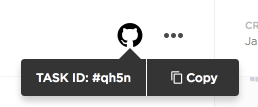

# Semantic Release

The template repository which supports semantic release version.

To find out more, please read the following link:

- https://www.conventionalcommits.org/en/v1.0.0-beta/
- https://semantic-release.gitbook.io/semantic-release/
- https://viblo.asia/p/semantic-versioning-OeVKBN2EKkW

# Semantic Commit Messages

Find out more [here](https://docs.google.com/presentation/d/1qvh8Tr4nCce4aOdYX7vkqQPoBbf2sfBTOYYsqhTBYRU)

See how a minor change to your commit message style can make you a better programmer.

Format: `<type>(<scope>): <subject>`

`<scope>` is defined depending on each team. It's optional except your commit has breaking change.

> Scope is only constraint when the commit has breaking change. These following scopes will be considered as next major release:
>
> - feat(major): your message
> - feat(breaking-change): your message

## The Header (required)

```
feat: add hat wobble
^--^  ^------------^
|     |
|     +-> Summary in present tense. No uppercase first character and should be a verb.
|
+-------> Type: chore, docs, feat, fix, refactor, style, or test.
```

More Examples:

- `feat`: (new feature for the user, not a new feature for build script)
- `fix`: (bug fix for the user, not a fix to a build script)
- `docs`: (changes to the documentation)
- `style`: (formatting, missing semi colons, etc; no production code change)
- `refactor`: (refactoring production code, eg. renaming a variable)
- `test`: (adding missing tests, refactoring tests; no production code change)
- `chore`: (updating grunt tasks etc; no production code change)
- `perf`: (changes related to performance improvements; no production code change)

## The Body (optional)

The body is optional lines that introduce the motivation behind the change or just describing slightly more detailed information.

Let’s take the recent example and add a body:

```sh
git commit -m "fix(core): remove deprecated and defunct wtf* apis" \
           -m "These apis have been deprecated in v8, so they should stick around till v10, but since they are defunct we are removing them early so that they don't take up payload size."
```

Now we attach to the message a couple of sentences that explain the purpose in detail.

Notice the following:

> - We use multiple -m in order to concatenate paragraphs instead of simple lines
> - The header and body are supposed to be separated by a blank line (and that’s distinctly true due to the paragraphs)

## The Footer (required)

The footer is a required line that link to the relevant task in software collaboration tool.

Here’s the recent commit message with a footer:

```sh
git commit -m "fix(core): remove deprecated and defunct wtf* apis" \
           -m "These apis have been deprecated in v8, so they should stick around till v10, but since they are defunct we are removing them early so that they don't take up payload size." \
           -m "CU-d0wqf"
```

In this case, we plainly add a reference to the relevant the Id of Clickup. Find out more [here](https://docs.clickup.com/en/articles/856285-github).



# References:

- https://www.conventionalcommits.org/
- https://seesparkbox.com/foundry/semantic_commit_messages
- http://karma-runner.github.io/1.0/dev/git-commit-msg.html
- https://gist.github.com/joshbuchea/6f47e86d2510bce28f8e7f42ae84c716
- https://nitayneeman.com/posts/understanding-semantic-commit-messages-using-git-and-angular
